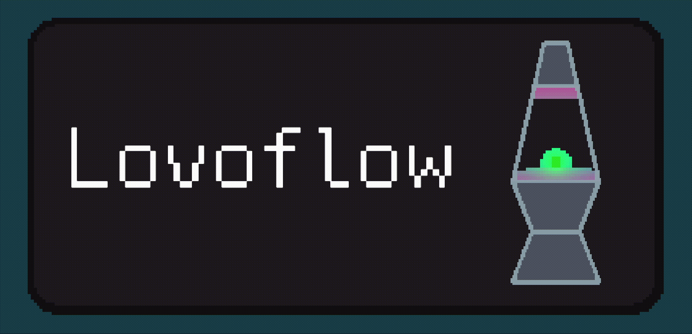

## Lovoflow

Solo-dev submission for [Global Game Jam](https://globalgamejam.org) built in a single week for the theme "Bubbles".

Check out the web demo! https://plyr4.github.io/lovoflow/

### About the game

Use heat to move your green ooze around a lava lamp.

Absorb good globs, or bad globs.

Be careful, bad blobs like heat.

If you want, collect good globs to boost the lamp's tranquility.

But most importantly, relax, and enjoy.

**Controls**:

- **WASD** keys to control the heat sources
- **ARROW** keys to control the heat sources
- **JOYSTICKS** to control the heat sources
- **BACKSPACE** or **START** to pause

## How Lovoflow works

The game runs on an HLSL shader-based implementation of [Metaballs](https://en.wikipedia.org/wiki/Metaballs). 

One material powers the game using a 32x32 texture file as input to tell the shader where to draw the metaballs. The shader has various properties to tweak how things are shown, like color, goopiness, and "heat". Each pixel of the 32x32 input texture represents a "bubble" or a "metaball" that renders in the shader. The single pixel holds a color value which represents various properties of the bubble. For example, the red (R) channel in the input texture represents an ID of a color in a palette lookup table, meaning with an extra lookup we can represent a wide range of colors using a single channel. 

A main controller synchronizes the game state with the input texture by writing changes every frame. This tells the shader where bubbles move, which ones collide, etc. This let me integrate cool things like physics into a 2d world rendered entirely via one shader.

Essentially, the game runs and state changes, which is written to a 32x32 texture, which tells the shader to render a cool dynamic lava lamp!

## Development

### Tools & Software

- Music was created using [Sonic Pi](https://sonic-pi.net/).
- Art was created using [Asperite](https://www.aseprite.org/) and [Blender](https://www.blender.org/).
- Other animations use [DOTween (free)](https://dotween.demigiant.com/).

## Installation

### Requirements

- [Unity 2022.3.25f1](https://unity.com/releases/editor/archive)

### How to run

This folder contains the entire Unity project for Lovoflow and all assets required to run and build the game.

Install Unity 2022.3.25f1 and add this directory as a project.

Open the core game scene `Assets/Scenes/Game.unity`.

Hit play!
